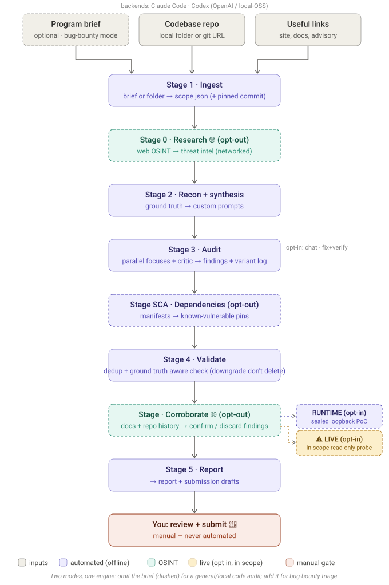
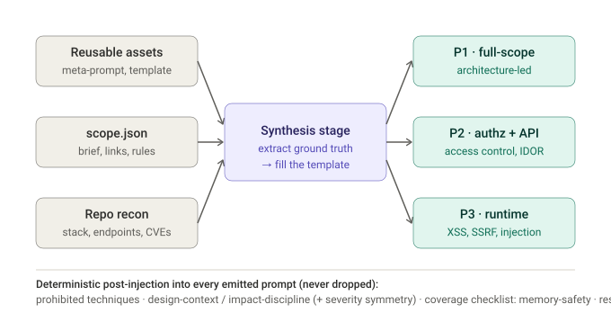

# 👁️ Argo — LLM-native static vulnerability detection

[](https://github.com/gigioneggiando/argo/actions/workflows/tests.yml)
[](LICENSE)

> *Argus Panoptes, the all-seeing watchman — a hundred eyes on your code.*

🌐 **Live findings:** [gigioneggiando.github.io/argo](https://gigioneggiando.github.io/argo/) — real vulnerabilities Argo found, disclosed as public PRs · 📖 [Wiki](https://github.com/gigioneggiando/argo/wiki) · 💬 [Discussions](https://github.com/gigioneggiando/argo/discussions)

Argo finds security vulnerabilities in **source code** by driving an LLM as the analyst — it reads
the code the way a human auditor would, rather than matching rules against a graph. Point it at any
codebase — a **local folder**, a private repo, or a public one — and it produces a reviewable
vulnerability report. The core idea: start from reusable general prompts and **automatically enrich
them** with target-specific context (stack, endpoints, docs, advisory history) — so every audit runs
with tailored prompts instead of generic ones. It runs on whatever you have: **Claude Code**, the
**Codex CLI** (OpenAI), or a **local open-source model**.

**Where it sits.** Argo is an **LLM-native SAST** — a complement and alternative to rule-based static
analyzers (CodeQL, Semgrep): nothing to write (no queries, no rule packs), and it catches
logic/authorization bugs that fixed patterns miss — at the cost of being *probabilistic* rather than
exhaustive (see [design-decisions](docs/design-decisions.md)). It is **static by design** — it never
executes the target (a hard guardrail), so it is *not* a DAST, fuzzer, or symbolic executor.
**Bug-bounty triage is one specialized mode** (scope/RoE ingest, submission drafts, cross-run
resubmission tracking), not the whole tool — see [Two modes](#-two-modes-general-audit-and-bug-bounty).

- 🔎 **Threat-informed audit** — opt-out Stage-0 web OSINT (CVEs, advisories, history) feeds recon.
- 🧠 **Archetype-driven prompts** — classifies the software, then writes custom audit prompts for it.
- 🛡️ **Adversarial validation** — a second model tries to *refute* each finding before it survives.
- 🌐 **Docs + history corroboration** — opt-out cross-check of each finding against the project's docs and the repo's VCS history (downgrades by-design, excludes already-fixed).
- 🎯 **Design-aware & impact-disciplined** — inject the vendor's accepted-by-design behaviors (`--accepted-risks`) + an anti-over-claim rule (no reflexive IMDS/SSRF escalation) so intended behavior isn't reported and impact isn't inflated.
- 🔌 **Multi-backend** — Claude / Codex / OpenAI / local-OSS, same pipeline (see [docs/backends.md](docs/backends.md)).
- 🩹 **Opt-in remediation** — proposes a patch per finding and **verifies it compiles** on an isolated copy.
- 💬 **Interrogation chat** — ask *"why didn't you find X?"* with full context ([worked example](docs/chat-example.md)).
- 📊 **Benchmarks & costs** — precision/recall harness + observed cost analytics.
- 🚫 **Detection-only, read-only, never live** — guardrails enforced in code, not just prompts.



---

## 🪪 Two modes: general audit and bug bounty

Argo runs in two modes over the **same** multi-stage engine:

| | **General code audit** (default) | **Bug-bounty triage** |
|---|---|---|
| **Input** | a folder or repo — **no brief** | a program brief (`--brief`) + links + repo |
| **Scope** | source-only, synthesized from the code (zero-token ingest) | parsed from the brief (assets, RoE, exclusions) |
| **For** | your own / private / personal code, OSS review, CTFs, research | scoped programs with safe harbor |
| **Extras** | — | submission drafts, scope filtering, cross-run resubmission tracking |

Auditing your own code is the common case: omit `--brief`, point `--repo` at a **local folder**, and
the repo is mounted read-only and never pushed anywhere (a local / OSS model keeps the source
fully on-device; a cloud backend sends it to its API to analyze). Bug-bounty mode adds the
program-specific scaffolding on top.

---

## 🔒 Principles and limits (read this first)

Argo is for **authorized** security review — your own code, bug-bounty programs with safe harbor,
CTFs, or research. Three constraints are enforced in the orchestrator, not left to the prompts:

1. **Never auto-submit.** The pipeline stops at drafts; submission is always a human action.
2. **Never contact live hosts by default**, even for `source_and_live` targets — analysis is static,
   on the source, and live verification steps are emitted as a text plan you run yourself inside the
   program rules (no DoS, no scanning). The **one** opt-in exception is the gated `argo live` stage
   (default **off**, requires `--i-have-authorization`): for **authorized** engagements it makes
   bounded, **in-scope-only**, read-only, capped, audit-logged requests to confirm findings — every
   request scope-locked to a registered in-scope asset (out-of-scope/unknown hosts hard-blocked).
   See [guardrails §2c](docs/guardrails.md#2c-the-opt-in-live-exception-the-live-stage-in-scope-hosts-only).
3. **Read-only repo** in every session: the pipeline never patches anything.

Additionally, prohibited techniques declared in scope (e.g. "no DoS") are propagated into every
generated prompt, and prompt rendering fails if they are missing (re-inserted verbatim if a model
paraphrases them — see [guardrails](docs/guardrails.md)).

---

## 🧩 The assets (the reusable core)

The security logic lives in the prompts; the orchestrator is only the glue that sequences them.

| File | Role |
|---|---|
| `00_recon_synthesis_meta_prompt.md` | Stage 2. Profiles the repo, reconciles it with scope, and **generates** the complementary custom prompts. This is where general-to-detailed enrichment happens. |
| `01_audit_prompt_template.md.j2` | Jinja skeleton every generated prompt conforms to. Fixed parts (role, finding format, rules of engagement, anti-false-positive constraints) never change; `{{ }}` slots carry target-specific content. |
| `02_adversarial_validation_prompt.md` | Stage 4. For each finding it opens a fresh context and tries to **break it**. Only findings that survive get promoted. |
| `09_deep_verify_prompt.md` | Stage VERIFY (opt-in). For each surviving finding, one full session re-derives it from the actual source and cross-checks it against every other survivor — split/merge/correct. |
| `scope_schema.json` | Structure of scope/rules. Authoritative input to every stage and the final findings filter. |
| `findings_schema.json` | Normalized findings format, for dedup and validation. |
| `BUILD_SPEC.md` | Specification to hand to a coding agent to build the orchestrator around the assets. |

---

## ✨ How enrichment works (Stage 2)

This is the heart of the design. Three things converge — the reusable assets (always the same),
`scope.json` with your links and rules, and the repo recon (stack, endpoints, CVE history) — and
out come the complementary custom prompts for that single scan.



The split is **archetype-driven**: Stage 2 first classifies what kind of software the target is
(web/API, CMS, plugin/extension, library/SDK, CLI, agent/LLM, mobile, data/ML pipeline, …) and
chooses the prompt partition that fits — typically 3 complementary prompts, always including one
architecture-led whole-system prompt — instead of a fixed web-app split. See
[docs/prompt-synthesis.md](docs/prompt-synthesis.md) for how the prompt maker works and how to
change it safely.

---

## 🗂️ Project layout

```
argo/
  cli.py
  models.py            # pydantic models for scope + findings
  runner.py            # AgentRunner interface (Claude headless · Codex · mock)
  stages/{ingest,research,recon,audit,sca,second_opinion,validate,corroborate,deep_verify,runtime,live,report}.py
  research.py·fixes.py·verify.py·benchmark.py·chat.py·costs.py·archetype.py
  prompts/             # the assets, version-controlled in git
  ledger.py            # SQLite findings + cost ledger
server/ · webapp/      # HTTP API + no-build web UI
runs/<RUN_ID>/         # scope.json, repo/, repo_profile.json, prompts/, findings/, REPORT.md
```

---

## 📥 Inputs: how to set up a program (bug-bounty mode)

> For a **general code audit** you need none of this — just `argo pipeline --repo ./your-code`
> (see [Two modes](#-two-modes-general-audit-and-bug-bounty)). The inputs below apply to **bug-bounty
> mode**, where a program brief defines the scope and rules.

Per program, three separate things land in three different places.

- **Program description** -> a text file passed with `--brief`. Paste the whole program page
  from the platform (scope, rules, rewards, exclusions, "no DoS").
- **Useful links** (site, docs, security page, advisory history) -> a text file, **one per
  line**, passed with `--links`. These are NOT the code.
- **Code repository** (e.g. the official GitHub) -> **not a link**, it is the codebase to
  analyze, passed with `--repo`.

Mnemonic: if it is something the agent must **read to understand** (site, docs, advisories) ->
`links.txt`. If it is the thing it must **analyze** (the code) -> `--repo`.

Example. Program folder:

`brief.md`
```
ACME CMS — Bug Bounty Program
Scope: app.acme.com, api.acme.com, the acme/acme-cms repository
Out of scope: *.staging.acme.com, third-party plugins
Rules: no DoS / volumetric testing, no social engineering, max 10 req/s on live
Rewards: Critical $$$, High $$, ...
```

`links.txt`
```
https://acme.com
https://docs.acme.com
https://acme.com/security
https://acme.com/security/advisories
```

Run:
```
argo ingest --brief brief.md --links links.txt --repo https://github.com/acme/acme-cms
```

Resulting `scope.json`:
```json
{
  "program_name": "ACME CMS",
  "program_brief_raw": "<contents of brief.md>",
  "in_scope": [{ "asset": "acme/acme-cms", "type": "source_repo" }],
  "out_of_scope": ["*.staging.acme.com", "third-party plugins"],
  "prohibited_techniques": ["no DoS / volumetric", "no social engineering", "max 10 req/s live"],
  "reference_links": ["https://acme.com", "https://docs.acme.com", "https://acme.com/security", "https://acme.com/security/advisories"]
}
```

Stage 2 takes `reference_links` and injects them at the top of every custom prompt, so the
prompts start out already knowing where to read docs and advisories.

---

## ⚡ Usage

```
argo ingest   --brief BRIEF --links LINKS --repo PATH_OR_URL   # Stage 1
argo recon    --run RUN_ID                                     # Stage 2
argo run      --run RUN_ID                                     # Stage 3
argo validate --run RUN_ID                                     # Stage 4
argo verify   --run RUN_ID                                     # Stage VERIFY (opt-in, deep re-derivation)
argo report   --run RUN_ID                                     # Stage 5
argo second-opinion --run RUN_ID --passes 2                    # extra blind passes merged in (opt-in, standalone)
argo pipeline --brief ... --links ... --repo ...               # 1-5, stops before submission
argo pipeline --brief ... --repo ... --verify                  # + deep-verify before reporting
argo pipeline --brief ... --repo ... --second-opinion 1         # + one independent blind re-audit merged in
argo pipeline --brief ... --repo ... --second-opinion 1 --second-opinion-backend codex  # cross-engine diversity
argo pipeline --repo ./my-code                                 # 🔐 local/personal review — NO brief, NO URL
```

**Auditing your own / private local code?** Omit `--brief` and point `--repo` at a **local folder**
(it does not need to be a git repo, and is **never pushed anywhere** — the repo is mounted read-only).
Argo synthesizes a minimal **source-only** scope from the folder (zero-token ingest, web research
auto-off) and audits it. Note the analysis itself: a **cloud backend** (Claude / Codex) sends the
source to that provider's API to analyze it — only a **local / OSS model** (`--codex-oss`) keeps
everything **fully on-device**.

Pick a backend (default `headless` = Claude Code):
```
argo pipeline ... --runner codex                                  # Codex CLI / OpenAI
argo pipeline ... --runner codex --codex-oss --codex-local-provider ollama --codex-model qwen2.5-coder:32b
```

Low-cost modes:
```
argo pipeline ... --runner mock   # exercises the whole glue with fixtures, zero tokens
argo pipeline ... --dry-run       # runs ingest+recon, shows generated prompts, then STOPS
argo pipeline ... --no-research   # skip the Stage-0 web OSINT (fully offline)
```

`--dry-run` is the prompt-quality feedback loop: it lets you eyeball the custom prompts before
paying to run them.

---

## 🖥️ Web UI

A no-build web interface (paste the program, point at the repo, watch the argo run live, read the
results, then chat with the analysis) ships in `webapp/` and is served by the API. Easiest:
**double-click `start.cmd`** (Windows) or run `./start.sh`. Or:

```
python -m argo.cli serve --open    # starts + opens http://127.0.0.1:8000
```

It defaults to the free **mock** runner; switch to a real run (with a budget) from the Advanced
panel. See [docs/ui.md](docs/ui.md) and [docs/api.md](docs/api.md).

---

## 🔬 The stages in detail

**1 — Ingest.** Parses the brief into `scope.json`, validated against `scope_schema.json`. If the
program forbids automation, raises a flag that forbids any live interaction for the whole run.
Clones/copies the repo into the run dir, read-only. `--accepted-risks FILE` records the vendor's
**intended / accepted-by-design behaviors** (their threat model / known-limitations) into the scope,
to be injected downstream so those behaviors are not re-reported as bugs.

**Design context + impact discipline** *(cross-cutting, always on)*. Every audit prompt (and the
validate/corroborate/verify prompts) carries an injected block that (a) enforces **impact discipline** —
report *proven* impact, not reflexive escalation, e.g. don't assert cloud-metadata/IMDS reachability
for an SSRF without evidence, and treat "an admin can do an admin thing" as by design — and (b) when
`--accepted-risks` is given, lists those behaviors so the model doesn't raise them. This attacks the
two hardest false-positive modes directly at the source, before a finding is even written.

**0 — Research** *(opt-out, one of two networked stages)*. From the brief, links, and program name it
does **public web OSINT** (CVEs, advisories, the project's security history) and writes
`research_brief.md` + `threat_intel.json`, injected into recon so the audit is threat-targeted. Never
touches the program's live in-scope hosts; `--no-research` keeps the run fully offline.

**2 — Recon + synthesis.** Runs `00_recon_synthesis_meta_prompt.md` with read access to the repo.
Produces `repo_profile.json`, the complementary custom prompts, `synthesis_notes.md`, and
**`ground_truth.json`** — a deep extraction (per focus) of security **invariants**,
**baseline-correct references** to diff siblings against, the enumerated **variant families**, and
target-specific **false-positive carve-outs**. Baking this into the prompts turns the audit from
open-ended hunting into closed-ended verification (the main precision + depth lever).

**3 — Audit.** For each prompt, a separate agent session in an isolated working dir, repo
read-only. Each session emits findings JSON (validated against `findings_schema.json`) and a
`VARIANT_HUNT_LOG` (one row per variant-family member). A **completeness-critic** re-pass
(`--critic-passes`, default 1) then re-audits each focus for what was missed, looping until dry. A
finding that drifts off-schema is **repaired and kept** (flagged), never silently dropped.

**SCA — Software-composition analysis** *(opt-out, between audit and validate)*. Reads dependency
manifests and flags pinned versions with known advisories as a `dependencies` focus. `--no-sca` or
a repo with no manifests skips it.

**SECOND-OPINION — Blind re-audit** *(opt-in, between SCA and validate; default off)*. Runs `--second-
opinion N` additional, fully independent recon+audit passes over the same already-ingested scope/repo
— each in its own isolated run directory, so it's genuinely blind to the primary pass's findings —
then merges their raw findings in before validate runs. This is the pipeline form of a manual
methodology used on real disclosures (fastjson2, open62541): a single LLM audit is one noisy sample
of what a careful reader would find, and an independent second pass (optionally on a different
backend via `--second-opinion-backend`, e.g. Claude for a Codex primary run) both recovers findings
the first pass missed and, when it independently converges on the same bug, produces a real
corroboration signal — surfaced in the report as "independently confirmed by N blind passes." A
failed pass is skipped, never aborts the run. Needs almost no new matching logic: validate's existing
structural + semantic dedup already collapses cross-pass duplicates the same way it collapses
cross-focus ones within a single pass.

**4 — Validate.** Merges findings, computes `dedup_key = sha1(normalize(file + line + cwe))` and
collapses duplicates. For each survivor, runs `02_adversarial_validation_prompt.md` in a fresh
context — now **ground-truth-aware** (the carve-outs + baseline-correct refs are injected).
**Downgrade-don't-delete:** `refuted` is reserved for findings provably contradicted by code (or
matching a carve-out); anything merely uncertain is **kept** as `needs_runtime_verification` with a
concrete question. Drops `out_of_scope`; keeps `confirmed` and `needs_runtime_verification`.

**CORROBORATE — Docs + history cross-check** *(opt-out, networked; after validate)*. For each
surviving finding, cross-checks it against the project's **own documentation** and the source repo's
**VCS history** (commits, releases, advisories) over public web OSINT — using `--docs-url`/scope
links + the repo URL if given, else searching for them. A finding the docs describe as **intended**
is downgraded to `design_accepted` (kept, flagged); one already **patched in a newer commit** is
moved to `fixed_upstream` (kept in a report appendix, never silently deleted); the rest stay
`corroborated`. Best-effort and never touches the live in-scope hosts; `--no-corroborate` skips it.
This is the automated form of the two false-positive modes vendors push back on most: "already
fixed" and "documented by design".

**VERIFY — Deep verify** *(opt-in, offline; after corroborate; default off)*. The final, deepest
check: unlike validate (adversarial but deliberately judges each finding in ISOLATION, batched,
excerpt-budgeted) and corroborate (networked but never opens the repo), deep-verify runs ONE full
agentic session per surviving finding — no batching, no excerpt budget, full `Read`/`Grep`/`Glob`
access to the actual repo — and independently **re-derives** each finding from the source, then
reasons **across the whole survivor set**. This catches what per-finding isolation structurally
cannot: a finding that's actually ≥2 distinct triggerable bugs (`split`, replaced by independent
sub-findings), two findings sharing one root cause (`merged`, folded into the other), or a finding
whose mechanism is real but a stated fact is wrong (`corrected`, kept with the fix noted). Every
verdict (even `reconfirmed`) requires an `independent_derivation` transcript — the file:line trail
actually walked — so the pass is auditable, not just trusted. Downgrade-don't-delete still applies:
only `refuted` drops a finding, `merged`/`split` originals are kept in report appendices. Off by
default (the most expensive annotation stage); enable with `--verify` on `argo pipeline` or run
`argo verify --run RUN_ID` standalone.

**RUNTIME — Runtime verification** *(opt-in, sandboxed; default off)*. Builds the OSS target from
the cloned source into an **ephemeral, egress-blocked, loopback-only** container (`--network=none`)
and probes **only that local instance** with HTTP PoCs to confirm/refute findings — never the
program's live hosts (same trust model as the Phase-6 isolated build). Read-only probes by default,
anti-DoS caps, no model execution primitive. Needs Docker + a launcher recipe; gracefully skips
otherwise. Full safety design in [docs/runtime-verification-study.md](docs/runtime-verification-study.md).

**5 — Report.** Produces `REPORT.md` (summary, findings sorted by validated severity then
confidence, "fix first" ordering, residual unknowns) and one DRAFT submission per confirmed
finding. Appends every finding to the SQLite ledger.

---

## 📦 Artifact capture

**Files are the source of truth**, the manifest is only an index. Each Claude session writes its
artifacts as separate files into its own scratch dir (`repo_profile.json`, one `.md` per prompt,
`SECURITY_FINDINGS__<focus>.json`, validation verdicts), each conforming to its schema. The final
message returns a small manifest indexing them. The orchestrator treats the files as
authoritative; if the manifest is missing or the session dies, it falls back to globbing the
scratch dir (partial recovery). Claude Code's `--output-format json` is used only for run metadata
(session id, cost, stop reason), never for the artifacts.

Reason: deep-audit findings and full prompts are too large to fit one stdout JSON without risking
truncation (which would silently drop findings); files survive long-session crashes and map
cleanly to the heterogeneous artifact types.

---

## 🔌 Backends & model strategy

**Backends.** Same pipeline, swappable engine — pick what you have:
`--runner headless` (Claude Code) · `--runner codex` (Codex CLI → OpenAI, or `--codex-oss
--codex-local-provider ollama|lmstudio` for **local open-source** models like Qwen/DeepSeek) ·
`--runner mock` (free fixtures). The guardrails are enforced per backend (Claude tool denylists,
Codex OS sandbox); cost is authoritative for Claude and token-estimated for Codex. Full details in
**[docs/backends.md](docs/backends.md)**.

**Resilience — multi-account & multi-backend fallback.** Backends and accounts chain transparently:
when one hits a **session/rate limit (429)** the same call is retried on the next (a per-run circuit
breaker disables the walled one; a non-retryable error propagates). Since limits are **per-account**,
two logged-in Claude accounts double your capacity before falling through to Codex:

```bash
# account A -> account B -> Codex, all transparent on a 429
python -m argo.cli pipeline --repo <url> --calibration \
  --claude-accounts ~/.claude,~/.claude-b --fallback codex
# set up the 2nd account once:  CLAUDE_CONFIG_DIR=~/.claude-b claude login
```
Codex multi-account works the same way (`--codex-accounts ~/.codex,~/.codex-b`, via `CODEX_HOME`).
So a long Opus run that used to wall on the Claude limit mid-`validate` now self-heals to the next
account/backend instead of degrading.

Per-stage Claude defaults (overridable per-run; Codex uses one model for all stages):

```
ingest      -> sonnet-4-6   (cheap extraction; never Haiku — misreading scope/RoE costs a lot)
recon       -> opus-4-8     (highest-leverage step: the whole audit's quality depends on it)
audit P1..Pn-> sonnet-4-6   (parallel; see note)
validate    -> opus-4-8     (cuts false positives)
report      -> sonnet-4-6
```

Key concept: validation (Opus) removes **false positives**, but does **not recover false
negatives** — bugs the audit model never surfaced are gone. So the audit model is the only lever
on the missed-bug rate, which is the failure that matters for vulnerability detection.

**Model landscape (why the backend is swappable).** Argo deliberately keeps the model behind the
`AgentRunner` interface, because detection quality tracks the model. The frontier is moving fast and
toward security specifically: Anthropic's **Claude Mythos 5** was described as having the strongest
cybersecurity capability of any model — strong enough that the general-use **Fable 5** ships with a
classifier that *routes* cybersecurity (and bio/chem) requests to Claude Opus 4.8 instead, and
direct access to Mythos/Fable 5 was later restricted under a US export-control directive
([Anthropic](https://www.anthropic.com/news/claude-fable-5-mythos-5),
[red.anthropic.com](https://red.anthropic.com/2026/mythos-preview/)). The takeaway for Argo: as
security-specialized models become accessible, the swappable backend means Argo gets better by
pointing at a stronger engine — no pipeline changes. Today it runs on the generally-available
backends above.

Calibration phase (first ~5 programs): override `audit -> opus-4-8`. While the prompts are
unproven, you don't want to confound "weak prompt" with "weak model" when diagnosing misses. Once
a class of targets reliably yields good findings, drop to Sonnet to scale. Per-target rule
thereafter: high expected bounty/severity -> audit on Opus; broad low-value sweeps -> Sonnet.

---

## 🧪 Development and testing

Recommended order: build the `MockClaudeRunner` + tests first, then the real headless runner. That
way, when you wire in the real model, the glue is already verified and any remaining problem comes
from the Claude Code interaction, not your logic.

Mock fixtures should exercise the **failure paths**, not the happy path: an out-of-scope finding
(scope filter), the same finding from two focuses (dedup), a refuted finding (drop), a missing
manifest (glob fallback), a session that died mid-write (partial recovery), an oversized findings
JSON (no truncation assumptions). Also keep one "recorded real run" fixture that replays the
artifacts of a genuine Opus run, so the mock stays realistic and catches output-shape drift.

Tests to ship: schema conformance at every stage boundary, a golden-file test for `REPORT.md`, and
regression tests on dedup + validation filtering.

---

## 🌐 Live targets

You mostly work on source, but some programs include live assets. There, static review produces
**hypotheses**, not proof of exploitability. The pipeline never touches a live host: for each
finding it emits a `live_verification_plan` (safe, in-scope, non-DoS steps) that you verify
manually against the instance, inside the program rules.

---

## 💡 Operational tips

- Keep prompts under git and record which version each run used: you can A/B test them and see
  which produce accepted findings.
- The SQLite ledger avoids re-reporting the same bug across runs/programs and tracks your hit rate.
- Log the cost of every LLM call (useful on the Max plan).
- The most useful metric to watch is the ratio of validation-confirmed findings to triager-accepted
  findings: if they diverge, tune the validation prompt.
- Always check whether a given program permits automated/AI tooling before running it.

---

## 📚 Further documentation

This README is the conceptual overview. Deeper, implementation-level docs live in [`docs/`](docs/):

| Doc | What's in it |
|---|---|
| [docs/architecture.md](docs/architecture.md) | Module map, data flow, the `AgentRunner` abstraction, `RunContext`, ledger schema, dedup algorithm |
| [docs/prompt-synthesis.md](docs/prompt-synthesis.md) | The archetype-driven prompt maker (Stage 2), the specificity self-check, reuse from the legacy generator, safe meta-prompt changes |
| [docs/cli-reference.md](docs/cli-reference.md) | Every command and flag, with examples (`--smoke`, `--budget`, caps, `--calibration`, …) |
| [docs/guardrails.md](docs/guardrails.md) | The non-negotiable guardrails and **exactly where each is enforced in code** |
| [docs/design-decisions.md](docs/design-decisions.md) | **Why** Argo is LLM-direct with **no CPG/AST engine**, what it uses instead, when we'd revisit, and threats to validity (paper-facing) |
| [docs/backends.md](docs/backends.md) | **Multi-backend**: run on Claude Code, the Codex CLI (OpenAI), or local/open-source models — the abstraction, per-backend guardrail mapping, cost, cross-model study |
| [docs/headless-runner.md](docs/headless-runner.md) | Real Claude Code integration: flags used, the JSON envelope, caps, error handling, partial recovery, the `--smoke` run |
| [docs/api.md](docs/api.md) | The HTTP API (`server/`) — backend for the web UI: endpoints, run lifecycle, live status/SSE, artifact whitelist |
| [docs/ui.md](docs/ui.md) | The web UI (`webapp/`) — `python -m argo.cli serve`, the no-build stack, the views |
| [docs/chat-example.md](docs/chat-example.md) | 💬 The interrogation chat — a real worked transcript (grounded explanation, false-positive self-correction, honest false negatives) |
| [docs/roadmap.md](docs/roadmap.md) | Planned UI + advanced features: per-feature analysis, phased build order, todo list (Phase 0 done) |
| [docs/configuration.md](docs/configuration.md) | `PipelineConfig` reference, per-stage models, budgets/caps |
| [docs/testing.md](docs/testing.md) | How to run the suite, what it covers, mock vs. headless |

## 📄 License

Apache License 2.0 — see [LICENSE](LICENSE). Argo is **detection-only** and intended for
**authorized** security testing (bug-bounty programs with safe harbor, your own code, CTFs, or
research). You are responsible for staying within the scope and rules of engagement of any program
you point it at.

